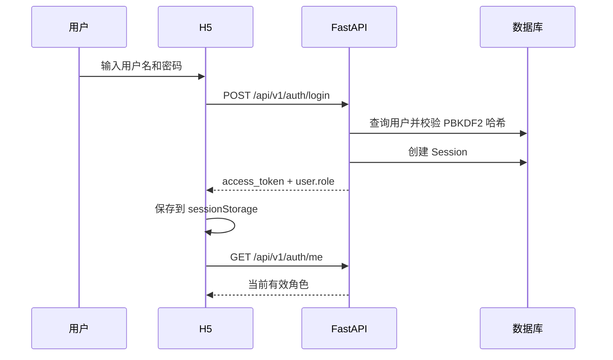
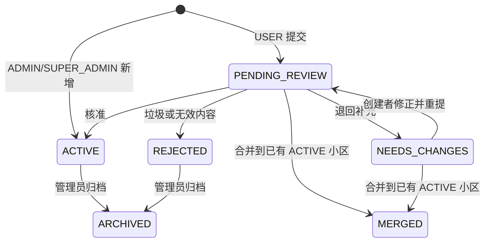
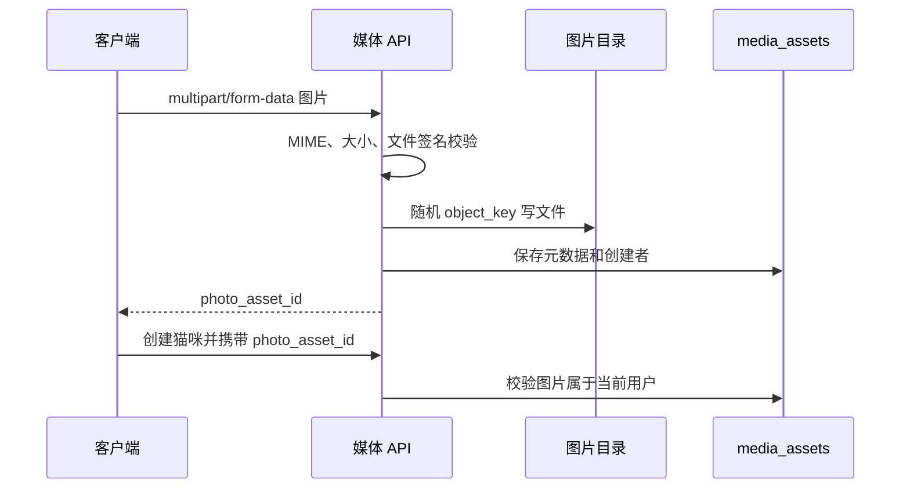

# 核心业务流程

## 1. 注册、登录与会话恢复

- 注册账号默认角色为 `USER`。
- 账号密码不会明文保存；数据库保存带随机盐的 PBKDF2 哈希。
- H5 刷新时使用 Token 调用 `/auth/me`，不信任旧的前端角色缓存。
- 退出登录会撤销服务端 Session，并清除当前标签页会话。
- 管理员从 H5 进入后台时复制同源 Token；后台仍重新校验角色。

## 2. 小区新增、候选联审与合并

### 普通用户

1. 登录 H5。
2. 可以在“我的”页单独提交建议，也可以在创建猫咪第二步切换到“填写新小区”。
3. 填写小区名称和所属街道。
4. 后端创建状态为 `PENDING_REVIEW` 的小区并写审计日志。
5. 用户在“我的提交”中查看待审核状态。
6. 管理员进入后台“小区管理”，查看候选、审核说明和当前已载入的关联猫咪。
7. 管理员可核准为 `ACTIVE`、退回为 `NEEDS_CHANGES`、合并为 `MERGED`，或只对垃圾/无效内容设为 `REJECTED`。
8. 退回后创建者可在“我的提交”修改并重新提交；客户端携带 `version`，过期写入返回 409 并刷新最新数据。

### 管理员/超级管理员

1. 可以在 H5 的角色感知小区表单中“新增并开放”。
2. 也可以进入管理后台“小区管理”，使用顶部表单新增。
3. 后端根据真实角色直接创建 `ACTIVE` 小区。
4. 新小区立即进入公开列表，可直接用于猫咪档案。

### 状态机

名称先经过 NFKC、大小写、空白和常见标点规范化后比较。`NEEDS_CHANGES`、`MERGED`、`REJECTED`、`HIDDEN` 或 `ARCHIVED` 不进入公开选择列表。旧客户端的 `{approved:false}` 在滚动发布期间仍映射历史 `HIDDEN`，新后台使用显式 `reject` 状态。

### 合并规则

1. 目标必须是另一个 `ACTIVE` 小区。
2. 后端锁定源候选及关联猫咪。
3. 所有关联猫咪改挂到目标小区，每只猫写 `COMMUNITY_REASSIGN` 审计。
4. 源候选设为 `MERGED` 并记录 `merged_into_id`。
5. 改挂、状态和审计只提交一次；任何一步失败都会整体回滚。

## 3. 猫咪档案创建与审核

1. 用户登录后点击“为猫咪建档”或浮动按钮。
2. 第一步填写名称、居住情况和健康情况。
3. 第二步可选择已经 `ACTIVE` 的小区，也可直接填写候选小区；切换模式不会清空其他猫咪字段。
4. 新候选和猫咪档案在同一个数据库事务中创建，共享非空 `community_id`；图片所有权、配额或任一校验失败时两者都不落库。
5. 第三步可选择照片并填写补充说明。
6. 如果有照片，客户端先上传媒体，取得 `photo_asset_id` 后再创建猫咪。
7. USER 创建的猫咪为 `PENDING_REVIEW`；ADMIN/SUPER_ADMIN 创建的猫咪为 `APPROVED`。
8. 管理员可在后台审核、隐藏、公开或归档档案；如果关联小区不是 `ACTIVE`，审核通过返回 `409 community_not_active`。

普通用户每日最多提交 3 条猫咪档案，计数按 `Asia/Shanghai` 日期计算。管理员不受该配额限制。

### 猫咪状态

审核状态：

- `PENDING_REVIEW`：等待审核。
- `APPROVED`：审核通过。
- `REJECTED`：审核不通过。

可见性状态：

- `ACTIVE`：允许公开。
- `HIDDEN`：临时隐藏。
- `ARCHIVED`：归档。

普通访客只看到同时满足 `猫咪 APPROVED + 猫咪可见性 ACTIVE + 小区 ACTIVE` 的档案。即使后台误操作，公开查询仍用 JOIN 条件二次拦截。管理员携带有效 Token 查询时可以看到全部档案和 `community_review_blocker`。

## 4. 分页与大数据量保护

- `/cats`、`/communities`、`/admin/communities` 默认返回 24 条，`limit` 最大 100。
- 排序键为 `(created_at DESC, id DESC)`，响应返回 `next_cursor`。
- H5 和后台只有在 `next_cursor` 存在时显示“加载更多”，追加时按 ID 去重。
- 过滤或审核写入后后台重置游标并从第一页刷新，避免旧页与新状态混合。
- 分页解决单请求数据量，不代表当前 SQLite 单机已经具备几十万并发能力；数据库和基础设施升级见路线图。

## 5. 图片上传

- 支持 JPEG、PNG、WebP。
- 默认最大 5 MiB。
- 后端不仅检查 MIME，还检查文件头签名。
- 用户只能把自己刚上传的媒体关联到自己的新档案。
- 当前没有图片压缩、EXIF 清理、病毒扫描或内容安全审核。

## 6. 救助任务

1. 管理员创建任务，可选关联小区。
2. 公开列表只返回 `OPEN` 任务。
3. 登录用户点击领取。
4. 后端加行锁读取任务；已被领取时返回 `task_already_claimed`。
5. 成功领取后状态变为 `CLAIMED`，记录领取者和时间，并写审计日志。

当前未实现完成、取消、转派、证据上传、任务评论和通知。

## 7. 超级管理员赋权

1. SUPER_ADMIN 进入管理后台“用户与权限”。
2. 后台加载 `/api/v1/admin/users`。
3. 对普通用户执行“设为管理员”，角色从 USER 变为 ADMIN。
4. 对管理员执行“撤销管理员”，角色从 ADMIN 变为 USER。
5. 后端拒绝修改 SUPER_ADMIN，也拒绝把任何用户直接设置为 SUPER_ADMIN。
6. 每次变更写 `ROLE_CHANGE` 审计日志。

## 8. 在线版本更新

H5 HTML 携带应用版本。页面首次加载和重新变为可见时，以 `no-store` 方式请求当前 HTML；如果服务器版本不同，显示更新提示。用户点击后刷新。

系统不自动刷新，因为强制刷新可能清空正在填写的猫咪、小区或图片表单。
