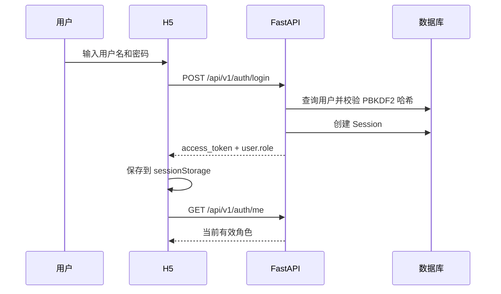
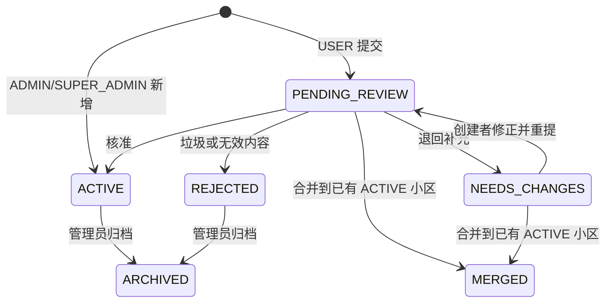
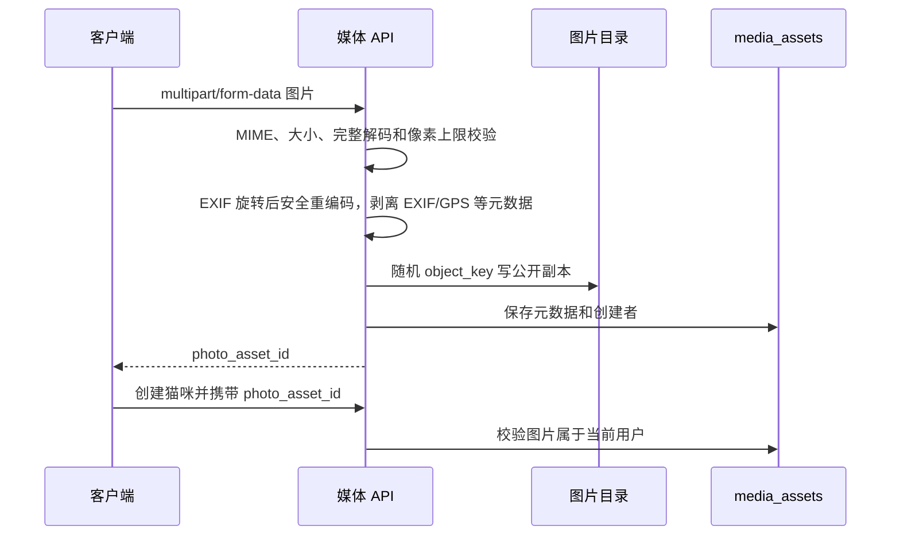
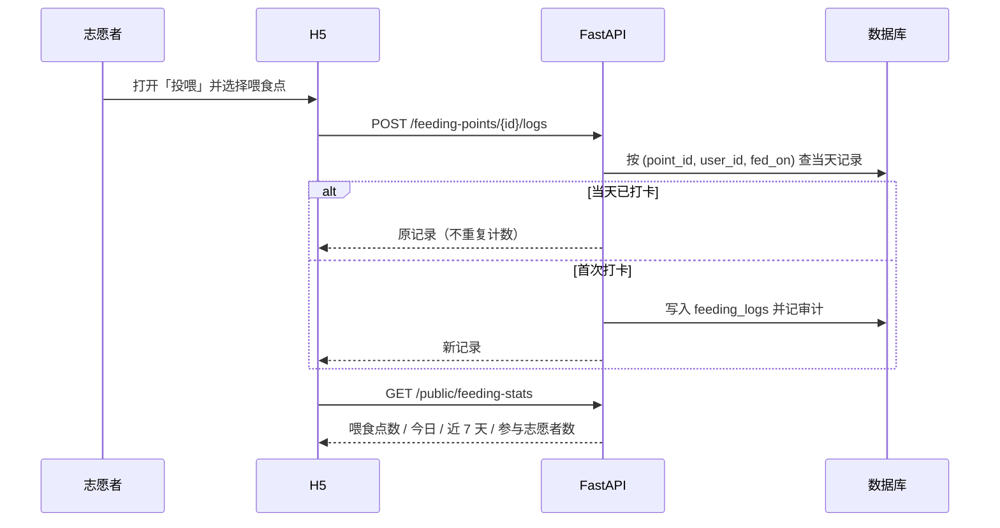
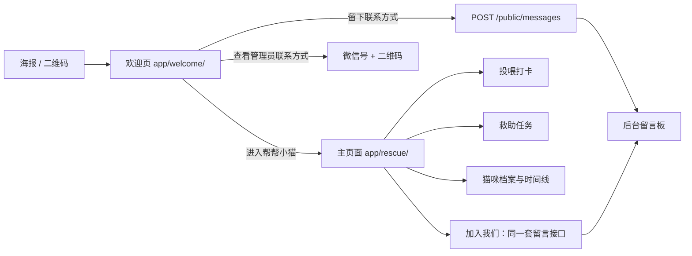

# 核心业务流程

## 1. 注册、登录与会话恢复



- 注册账号默认角色为 `USER`。
- 账号密码不会明文保存；数据库保存带随机盐的 PBKDF2 哈希。
- H5 刷新时使用 Token 调用 `/auth/me`，不信任旧的前端角色缓存。
- 退出登录会撤销服务端 Session，并清除当前标签页会话。
- 管理员从 H5 进入后台时复制同源 Token；后台仍重新校验角色。

## 2. 小区新增、候选联审与合并

### 普通用户

1. 登录 H5。
2. 可以在“我的”页单独提交建议，也可以在创建猫咪第二步切换到“填写新小区”。
3. 填写小区名称和所属街道。
4. 后端创建状态为 `PENDING_REVIEW` 的小区并写审计日志。
5. 用户在“我的提交”中查看待审核状态。
6. 管理员进入后台“小区管理”，查看候选、审核说明、服务端关联总数和最多 3 只猫咪预览。
7. 管理员可核准为 `ACTIVE`、退回为 `NEEDS_CHANGES`、合并为 `MERGED`，或只对垃圾/无效内容设为 `REJECTED`。
8. 退回后创建者可在“我的提交”修改并重新提交；客户端携带 `version`，过期写入返回 409 并刷新最新数据。

### 管理员/超级管理员

1. 可以在 H5 的角色感知小区表单中“新增并开放”。
2. 也可以进入管理后台“小区管理”，使用顶部表单新增。
3. 后端根据真实角色直接创建 `ACTIVE` 小区。
4. 新小区立即进入公开列表，可直接用于猫咪档案。

### 状态机



名称先经过 NFKC、大小写、空白和常见标点规范化后比较。`NEEDS_CHANGES`、`MERGED`、`REJECTED`、`HIDDEN` 或 `ARCHIVED` 不进入公开选择列表。旧客户端的 `{approved:false}` 在滚动发布期间仍映射历史 `HIDDEN`，新后台使用显式 `reject` 状态。

### 合并规则

1. 目标必须是另一个 `ACTIVE` 小区。
2. 后端锁定源候选及关联猫咪。
3. 所有关联猫咪改挂到目标小区，每只猫写 `COMMUNITY_REASSIGN` 审计。
4. 源候选设为 `MERGED` 并记录 `merged_into_id`。
5. 改挂、状态和审计只提交一次；任何一步失败都会整体回滚。

### 驳回后的恢复规则

`REJECTED`、`HIDDEN` 或 `ARCHIVED` 小区不会让关联猫咪变成“未归属”。后台猫咪卡片会显示阻塞状态，管理员可按名称搜索全部 `ACTIVE` 小区，携带猫咪当前 `version` 单只改挂；改挂写 `COMMUNITY_REASSIGN` 审计，随后才能审核公开。

## 3. 猫咪档案创建与审核

1. 用户登录后点击“为猫咪建档”或浮动按钮。
2. 第一步填写名称、居住情况和健康情况。
3. 第二步可选择已经 `ACTIVE` 的小区，也可直接填写候选小区；切换模式不会清空其他猫咪字段。
4. 新候选和猫咪档案在同一个数据库事务中创建，共享非空 `community_id`；图片所有权、配额或任一校验失败时两者都不落库。
5. 第三步可选择照片并填写补充说明。
6. 如果有照片，客户端先上传媒体，取得 `photo_asset_id` 后再创建猫咪。
7. H5 为本次建档生成用户作用域 `Idempotency-Key`；网络失败后保留该键重试。后端数据库唯一约束保证只生成一条猫咪记录并只消耗一次配额。
8. USER 创建的猫咪为 `PENDING_REVIEW`；ADMIN/SUPER_ADMIN 创建的猫咪为 `APPROVED`。
9. 管理员可在后台审核、隐藏、公开或归档档案；如果关联小区不是 `ACTIVE`，审核通过返回 `409 community_not_active`。

普通用户每日最多提交 3 条猫咪档案，计数按 `Asia/Shanghai` 日期计算。管理员不受该配额限制。

### 猫咪状态

### 自动预检（`HELPCAT_AUTO_REVIEW`）

管理员自己提交的档案照旧免审；普通用户的投稿按这个开关走：

| 取值 | 行为 |
|---|---|
| `off`（默认） | 一律进待审 |
| `shadow` | **只计算并写审计，不改任何状态**（先观察判定结果） |
| `on` | 规则全过就直接公开；通过时会把**待审的新小区一起开放**（小区不开放，猫通过了也看不见） |

规则在 `server/helpcat/auto_review.py`，刻意保守，任一条不满足就交给人：

- 有照片；
- 所属小区已开放（新小区则要求"街道已存在 + 名字格式正常 + 无联系方式/测试标记"）；
- 位置描述**不含门牌号/楼栋/单元**（`3号楼门口`、`12 栋楼下`、`5单元` 这类一律不进公开页）；
- 健康状态不是"可能需要帮助"（医疗表述留给人判断）；
- 文字里没有手机号、微信、链接、`[QA-`、`测试` 之类；
- 昵称格式正常。

`:backstage` 每次判定都写一条审计（`AUTO_APPROVE` 或 `AUTO_REVIEW`），记录模式、命中的规则与未通过的规则，事后可查。

### 后台批量审核

`POST /api/v1/admin/reviews/approve` 一次通过多条（单条审核与它共用 `helpcat/reviews.py` 里的同一段实现，校验不会分叉）：

- 每条带上 `version`，过期页面**不会覆盖**别人的改动，冲突的那条会被跳过并在结果里说明；
- `include_communities=true`（默认）时，通过猫咪会把**它挂着的待审小区一起开放** —— 这是"提交新小区 + 新猫咪"原来要点两次的根源；
- 后台猫咪档案页与小区页都有勾选框 + "全选本页待审" + "批量通过"。

审核状态：

- `PENDING_REVIEW`：等待审核。
- `APPROVED`：审核通过。
- `REJECTED`：审核不通过。

可见性状态：

- `ACTIVE`：允许公开。
- `HIDDEN`：临时隐藏。
- `ARCHIVED`：归档。

普通访客只看到同时满足 `猫咪 APPROVED + 猫咪可见性 ACTIVE + 小区 ACTIVE` 的档案。即使后台误操作，公开查询仍用 JOIN 条件二次拦截。管理员携带有效 Token 查询时可以看到全部档案和 `community_review_blocker`。

### 77 公开档案的受控导入

发布任务在完成数据库备份、确认目标 `community_id` 和待复核肖像后，可使用幂等导入脚本：

```bash
python scripts/help_cat_77_seed.py \
  --base-url https://api.example.com \
  --username 77-editor \
  --password-env HELP_CAT_77_PASSWORD \
  --community-id verified-community-id \
  --photo /approved/77-portrait.webp
```

脚本只从指定的环境变量读取密码，使用固定幂等键调用 `/api/v1/admin/cat-drafts/import`，输出仅包含 `cat_id`、`media_id` 和是否发生变更。媒体与猫咪在同一操作中成功或失败；稳定唯一键为 `profile_key=story-77`，重复 key 会明确失败而不会任选记录。首次导入只产生 `PENDING_REVIEW + HIDDEN` 草稿，脚本不会审核、公开或重新公开既有隐藏档案。管理员必须在后台人工核对照片、社区和字段，再分别审核与公开。导入字段保持未知健康状态，不推断性别、疫苗、绝育、健康细节、精确地址或坐标。

## 4. 分页与大数据量保护

- `/cats`、`/communities`、`/tasks`、`/me/submissions`、`/admin/communities`、`/admin/users` 默认返回 24 条，`limit` 最大 100。
- 排序键为 `(created_at DESC, id DESC)`，响应返回 `next_cursor`。
- H5 和后台只有在 `next_cursor` 存在时显示“加载更多”，追加时按 ID 去重。
- 过滤或审核写入后后台重置游标并从第一页刷新，避免旧页与新状态混合。
- 分页解决单请求数据量，不代表当前 SQLite 单机已经具备几十万并发能力；数据库和基础设施升级见路线图。

## 5. 图片上传



- 支持 JPEG、PNG、WebP。
- 默认最大 5 MiB。
- 后端检查 MIME，并完整解码 JPEG、PNG 或 WebP；内容与声明类型不符会被拒绝。
- 解码后限制总像素数，按 EXIF 朝向纠正后安全重编码；公开下载不保留 EXIF、GPS、设备或拍摄时间元数据。
- 用户只能把自己刚上传的媒体关联到自己的新档案。
- 当前仍没有病毒扫描或自动内容安全审核，公开前仍需人工复核。

## 6. 救助任务

1. 管理员创建任务，可选关联小区。
2. 公开列表只返回 `OPEN` 任务。
3. 登录用户点击领取。
4. 后端加行锁读取任务；已被领取时返回 `task_already_claimed`。
5. 成功领取后状态变为 `CLAIMED`，记录领取者和时间，并写审计日志。

当前未实现完成、取消、转派、证据上传、任务评论和通知。

## 7. 超级管理员赋权

1. SUPER_ADMIN 进入管理后台“用户与权限”。
2. 后台分页加载 `/api/v1/admin/users`。
3. 对普通用户执行“设为管理员”，角色从 USER 变为 ADMIN。
4. 对管理员执行“撤销管理员”，角色从 ADMIN 变为 USER。
5. 后端拒绝修改 SUPER_ADMIN，也拒绝把任何用户直接设置为 SUPER_ADMIN。
6. 每次变更写 `ROLE_CHANGE` 审计日志。

## 8. 在线版本更新

H5 HTML 携带应用版本。页面首次加载和重新变为可见时，以 `no-store` 方式请求当前 HTML；如果服务器版本不同，显示更新提示。用户点击后刷新。

系统不自动刷新，因为强制刷新可能清空正在填写的猫咪、小区或图片表单。

## 9. 定点投喂打卡



- `fed_on` 取 Asia/Shanghai 日期，因此「同一个人 + 同一个喂食点 + 同一天」只记一次，重复提交返回原记录。
- 喂食点由管理员创建；`PAUSED`/`ARCHIVED` 不出现在公开列表，也不能打卡（返回 404）。
- 统计与首页四项指标是两套口径：首页来自管理员录入的 `impact_events`，投喂统计来自实际打卡。

### 每日打卡玩法

1. 居民端默认用 `sort=today` 拉取喂食点：今天没人喂的排最前，卡片标记「今天还没人喂」，顶部汇总「今天还有 N 个喂食点没人喂」。
2. 点「按距离排序」会请求定位；授权后服务端按 Haversine 距离排序并返回 `distance_m`（不分页），未授权则降级为按待喂情况排列并提示用户。
3. 打卡后 `GET /feeding-logs/mine/summary` 返回连续天数、本周与累计天数、今日是否打卡、下一里程碑（3/7/14/30/60 天）；居民端用近 7 天点阵展示打卡节奏。
4. 连续天数的判定：从今天往前数连续有打卡的天数；今天还没打卡时从昨天往前数（断掉整天才会清零）。
5. 喂食点坐标由管理员在后台填写（新增时填，或对已有投喂点在卡片上「补坐标」）；没有坐标的点不参与距离排序。

### 排班认领（未来 7 天谁负责）

1. 投喂页顶部是一张「未来 7 天谁负责」的排班表：行是喂食点，列是今天起 7 天；空格显示「认领」，点一下即认领该天。
2. 认领约束：日期必须在今天到 +13 天之间；同一喂食点同一天只允许一个有效认领（后到者 409，界面提示已被认领）；认领人可以取消，已完成的班次只有管理员能取消。
3. 志愿者姓名对公众脱敏成「张**」，同时返回 `is_mine` 让本人看到「我」；接口不返回 openid 或原始昵称。
4. 认领当天完成打卡后，该班次自动从 `CLAIMED` 变为 `DONE`，所以「排班 → 打卡」是一条连贯动作，不需要额外确认。
5. 喂食点卡片上会显示「今天由谁负责 / 今天的排班还空着」，把「有人负责」直接摆在打卡入口旁边。

## 10. 任务闭环

`OPEN → CLAIMED → COMPLETED`，或任一非终态 → `CANCELLED`。

1. 管理员在后台「救助任务」发布任务，可关联小区。
2. 登录用户领取；公开列表只返回 `OPEN`。
3. 领取者在「我领取的任务」上报完成，可填完成说明并附一张现场照片。
4. 管理员可取消（记录原因）或转派给他人；领取者本人可退回任务池。
5. 完成、取消、转派都写审计日志。

权限：领取者或管理员可上报完成；取消与转派限管理员（普通用户只能退回自己领取的任务）。

## 11. 猫咪时间线

- 管理员在后台猫咪卡片上「记录时间线」，`kind` ∈ 相遇 / 投喂 / 就医 / 检查 / 领养 / 备注。
- 公开时间线只在猫咪满足「已通过 + 已公开 + 所属小区 ACTIVE」时返回，否则 404。
- 时间线不包含精确坐标、联系方式和未确认的医疗结论。

## 12. 推广流程：扫码 → 欢迎页 → 主页面



欢迎页保留一份写死的微信号，作为 API 不可用时的兜底；留言会带上 `?from=` 或 referrer 作为来源渠道，便于评估投放效果。
