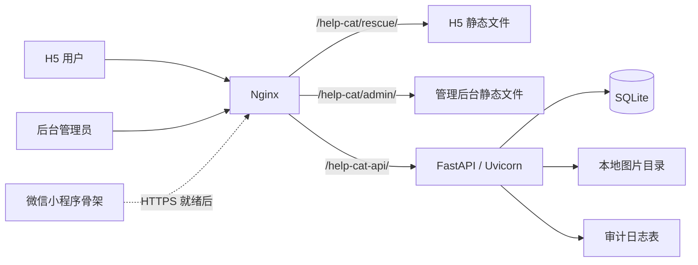
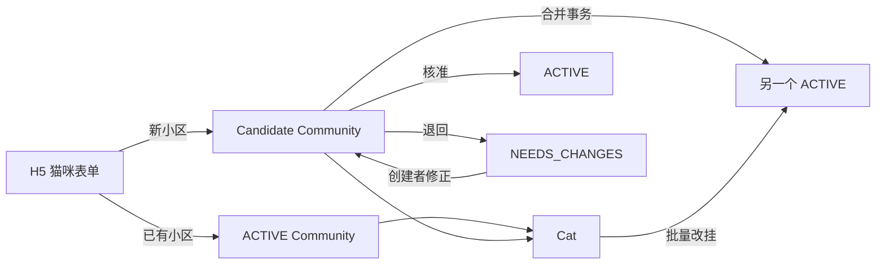
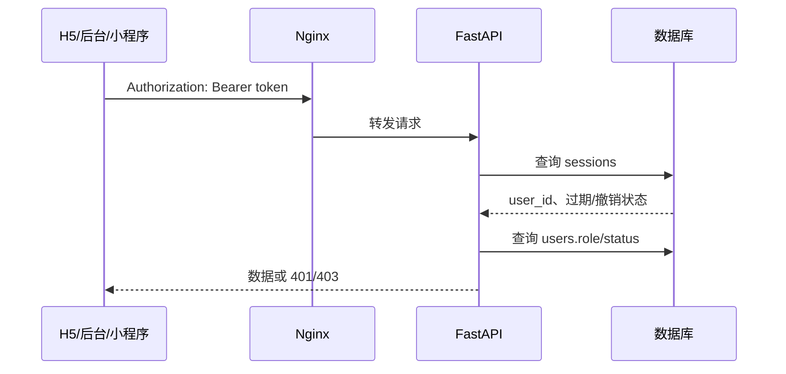

# 系统架构

## 当前生产拓扑



当前所有生产组件运行在一台服务器上。Nginx 提供静态资源并把 `/help-cat-api/` 反向代理到 `127.0.0.1:18000` 的 Uvicorn 服务。

## 客户端

### H5 用户端

目录：`app/rescue/`

- `index.html`：四个主视图、登录弹层、猫咪三步表单、小区表单和底部导航。
- `api.js`：会话保存、统一请求、错误转换、图片上传和登录恢复。
- `community-form.js`：建档小区二选一 payload、候选纠错、状态元数据和分页去重，可在 Node 中独立测试。
- `app.js`：状态管理、数据加载、渲染、表单和业务交互。
- `styles.css`：设计变量、响应式布局、猫咪卡片、任务和表单样式。

H5 使用原生 JavaScript，不依赖 React/Vue 构建链。优点是部署简单、静态体积小；缺点是 `app.js` 已承担较多职责，继续增长时应拆分为账号、小区、猫咪、任务和视图模块。

### 管理后台

目录：`admin/`

- 独立登录页和管理 Shell。
- 通过 `help_cat_admin_token` 保存后台会话。
- 支持猫咪审核/可见性/归档、小区新增/审核/归档和用户角色管理。
- `community-review.js` 独立构造核准、退回、合并、驳回请求，先在本地验证理由、目标和版本。
- 左上品牌链接只返回 H5 首页；会话 Token 保存在同源 `sessionStorage`，不进入 URL。
- 页面显示控制与后端鉴权同时存在；真正的权限边界在 FastAPI。

### 微信小程序

目录：`miniprogram/`

当前是代码骨架而不是可提交审核的成品。页面包括首页、猫咪新增、我的提交和救助任务；`utils/api.js` 封装 `wx.request`、`wx.login` 和 `wx.uploadFile`。API 地址仍为示例域名，真实微信 Provider 未完成。

## 后端分层

目录：`server/helpcat/`

```text
app.py          HTTP 路由、业务规则、审计写入
auth.py         密码哈希、Session、当前用户和角色校验
community_rules.py 小区名称规范化规则
models.py       SQLAlchemy 数据模型
schemas.py      Pydantic 输入模型
config.py       环境变量和运行设置
db.py           Engine、SessionFactory、兼容性 schema bootstrap
migrations/     Alembic 迁移
```

## 候选小区与猫咪一致性

候选小区复用 `communities` 表，而不是另建临时表。这样每只猫始终拥有非空 `community_id`，候选核准后无需改猫，候选合并时才把关联猫咪批量改挂到目标 `ACTIVE` 小区。



- 新候选、猫咪、配额变化和审计在一次事务中提交。
- 编辑、审核和合并通过 `version` 乐观锁防止静默覆盖；SQLAlchemy mapper 在实际 `UPDATE` 中加入旧版本谓词，不依赖 SQLite 无效的 `FOR UPDATE`。
- 归档和单只猫咪改挂同样要求当前 `version`；被驳回候选不会让猫咪进入永久死路。
- H5 猫咪建档发送用户作用域的 `Idempotency-Key`，网络丢包后重试不会重复创建或重复消耗日配额。
- 数据库通过部分唯一索引约束同一城市/区县的有效规范名，通过真实自外键约束 `merged_into_id`。
- 猫咪审核接口和公开查询分别检查小区 `ACTIVE`，形成双重发布门禁。
- 猫咪、公开小区、任务、本人提交、后台审核和用户集合使用稳定游标分页，默认 24、最大 100。
- 后台小区页由服务端返回关联猫咪总数和最多 3 条预览；合并/改挂目标通过服务端搜索，不依赖当前已加载页面。

当前 `app.py` 同时承担路由与领域业务。进入规模化阶段前，应把认证、小区、猫咪、任务、媒体和管理员服务拆成独立模块，但无需在 MVP 阶段为了形式提前引入微服务。

## 请求与鉴权链路



- 用户端 Token 键：`help_cat_token`。
- 管理端 Token 键：`help_cat_admin_token`。
- H5 进入后台时在同源下复制当前 Token，后台仍调用 `/api/v1/auth/me` 验证角色。
- Session 默认有效期 30 天；退出时写 `revoked_at`。

## 生产目录

```text
/data/purchase-system/frontend/dist/help-cat/rescue/   H5 静态资源
/data/purchase-system/frontend/dist/help-cat/admin/    管理后台静态资源
/opt/help-cat/release/                                 当前后端发布目录
/opt/help-cat/data/help-cat.db                         SQLite 数据库
/opt/help-cat/data/uploads/                            图片文件
/opt/help-cat/releases/                                时间戳 release
/opt/help-cat/backups/                                 时间戳备份
```

后端由 `help-cat.service` 管理，Uvicorn 监听 `127.0.0.1:18000`。生产数据库和媒体目录不进入 Git 仓库。

## 当前容量边界

当前架构的限制：

- SQLite 单文件写锁不适合高并发写入和多实例部署。
- 本地图片绑定单机，无法水平扩容，也没有 CDN。
- Session 存在数据库中，没有集中缓存、设备管理或高并发限流。
- 主要集合已经完成游标分页；审计日志尚无查询 API 和分页界面。
- 没有消息队列，图片处理、通知和内容安全都在请求链外缺失。
- 没有正式监控、链路追踪、SLO、容量压测和自动故障转移。

因此当前版本是业务闭环 MVP，不是几十万用户的最终架构。升级顺序见 [[规模化路线图]]。

## 架构评估与优化路线（2026-09-24 实测，P0/P1 已完成）

### 实测现状

| 维度 | 实测 | 判断 |
|---|---|---|
| 后端 | `app.py` **76 行**（只组装），11 个领域 router + `serializers`/`pagination`/`media`/`domain`/`dependencies`，58 条路由 | P0/P1 已做完；单文件瓶颈解除 |
| 前端 | 无构建链，`rescue/app.js` 1707 行 + `styles.css` 1072 行、`admin/app.js` 930 行 | 仍可用，但接近上限（P2） |
| 数据 | SQLite，`journal_mode=WAL` + `busy_timeout=5000` + `synchronous=NORMAL` | 读不再被写阻塞 |
| Schema 来源 | Alembic 12 个迁移是唯一权威；`ensure_schema` 的裸 ALTER 已收敛成迁移 `011_bootstrap_parity`，与运行期兜底共用 `schema_upgrades.py` 一份定义 | 空库/旧库/线上库三条路径收敛到同一结构（有 parity 测试） |
| 图片 | nginx 直出（`X-Accel-Redirect`），FastAPI 只做校验 | 不占 worker |
| 并发 | uvicorn `--workers 2` | 应用无进程内状态，可继续加 |
| 静态缓存 | 版本化资源长缓存 + `Cache-Control`；HTML `no-cache` | 改静态资源必须升版本号（已脚本化） |
| 应用状态 | `app.state` 只有 settings / session_factory / provider / current_user；会话、配额、限流都在库里 | 请求处理无进程内状态 → 可以安全加 worker |
| CI | `.github/workflows/tests.yml`，push 即跑两个测试根，**无 deselect** | 266 个测试全绿 |
| 备份 | `scripts/backup_offsite.sh`：WAL 安全快照 + 自检 + 保留期 + 异地钩子；systemd 每日 03:20 | 异地目标需在服务器上配（见部署文档） |
| 可观测性 | `/api/v1/health`（liveness）+ `/api/v1/health/ready`（真查库）+ `scripts/health_check.sh` + 5 分钟 systemd timer + 告警 webhook；journald 与 nginx 日志有轮转 | 只差把外部 uptime 监控指到 readiness（需要账号） |

### 优化路线

**P0 —— 已完成（2026-09-23）**

1. ~~图片改由 nginx 直出~~ ✅ `X-Accel-Redirect`，两条静态入口都验证过。
2. ~~补 `Cache-Control`~~ ✅ 版本化资源 `immutable`、HTML `no-cache`、图片长缓存。
3. ~~SQLite 开 WAL~~ ✅ 每条连接都带 WAL / `busy_timeout` / `synchronous=NORMAL`。
4. ~~uvicorn 提到 2 workers~~ ✅ 已确认应用无进程内状态。
5. ~~加 CI~~ ✅ push 即跑 pytest。

**P1 —— 已完成（2026-09-24）**

6. ~~拆 `app.py`~~ ✅ 11 个领域 router + 共享模块；`app.py` 只剩 76 行组装。等价性由 123 个 API 测试、逐字一致的 OpenAPI 文档和 `tests/test_app_split_contract.py` 共同保证。
7. ~~Schema 单一来源~~ ✅ 迁移 `011_bootstrap_parity` 收录了原先写在 `ensure_schema` 里的 23 条裸 ALTER；`schema_upgrades.py` 是唯一一份定义，迁移与运行期兜底都调它。顺带修掉两个真 bug：`001_initial` 用 `create_all` 导致迁移链从空库跑不完、`006` 漏建 `ix_impact_events_created_by`。
8. ~~异地备份~~ ✅ `scripts/backup_offsite.sh`（一致性快照 + `--verify` 自证可恢复 + 保留期 + rclone/coscmd/s3/自定义上传钩子）+ `deploy/systemd/help-cat-backup.{service,timer}`。**仍需在服务器 `/etc/help-cat/backup.env` 里填异地目标**，否则只落本盘。
9. ~~探活与告警~~ ✅ readiness 探针 + `scripts/health_check.sh` + `help-cat-healthcheck.timer`（5 分钟）+ webhook 告警 + 日志轮转（`deploy/logrotate/help-cat`、`deploy/journald/help-cat.conf`）。**仍需注册一个外部 uptime 监控指向 readiness 地址**。
10. ~~版本号自动升~~ ✅ `scripts/bump_version.sh`（`--next` / `--check` / `--dry-run`），把两条版本线的所有落点写死，漏升会失败。

**P2 —— 规模上来再说**

11. 媒体放对象存储 + CDN。
12. 迁移到 PostgreSQL（真出现并发写压力时；当前规模 SQLite + WAL 足够）。
13. 前端引入构建链（`app.js` 继续增长时；顺带解决「无构建链所以靠 URL 版本号失效」）。

### 当前容量边界

- SQLite 单写者：写入串行；WAL 之后读不再被写阻塞。
- 全部组件在一台 VM 上，无冗余；异地备份配好之前，磁盘故障仍会连备份一起丢。
- 2 个 uvicorn worker 共用同一个 SQLite 文件：写入压力上来后要先看锁等待，再考虑 PostgreSQL。

