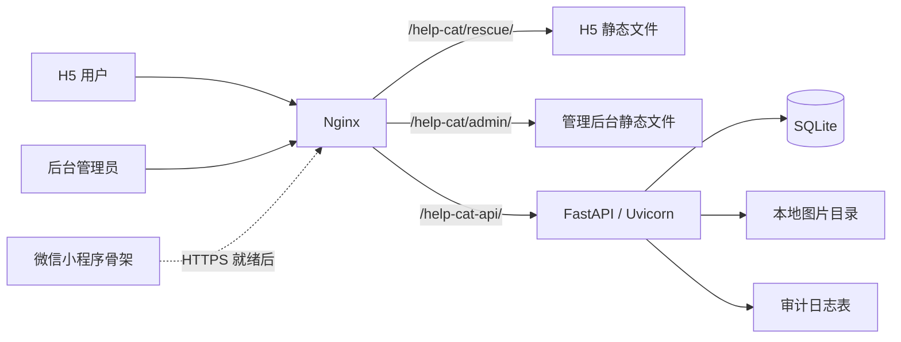
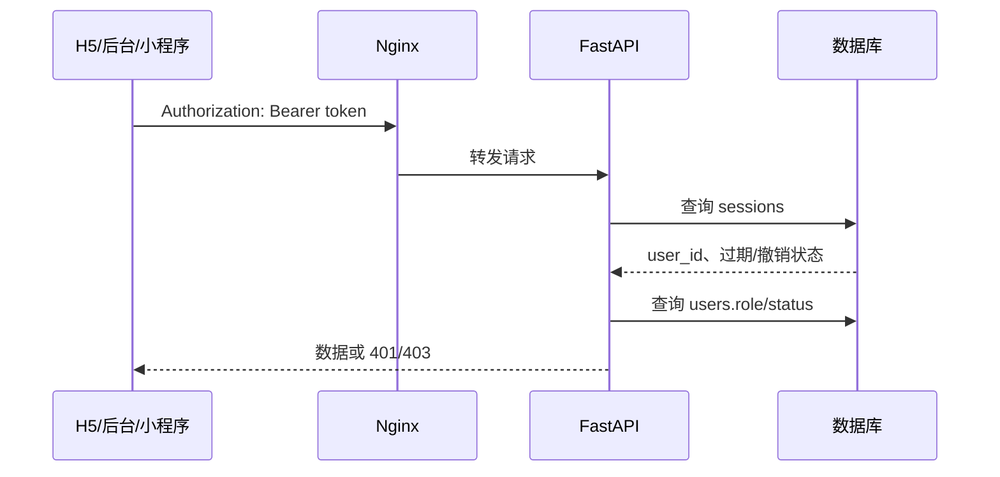

# 系统架构

## 当前生产拓扑



当前所有生产组件运行在一台服务器上。Nginx 提供静态资源并把 `/help-cat-api/` 反向代理到 `127.0.0.1:18000` 的 Uvicorn 服务。

## 客户端

### H5 用户端

目录：`app/rescue/`

- `index.html`：四个主视图、登录弹层、猫咪三步表单、小区表单和底部导航。
- `api.js`：会话保存、统一请求、错误转换、图片上传和登录恢复。
- `app.js`：状态管理、数据加载、渲染、表单和业务交互。
- `styles.css`：设计变量、响应式布局、猫咪卡片、任务和表单样式。

H5 使用原生 JavaScript，不依赖 React/Vue 构建链。优点是部署简单、静态体积小；缺点是 `app.js` 已承担较多职责，继续增长时应拆分为账号、小区、猫咪、任务和视图模块。

### 管理后台

目录：`admin/`

- 独立登录页和管理 Shell。
- 通过 `help_cat_admin_token` 保存后台会话。
- 支持猫咪审核/可见性/归档、小区新增/审核/归档和用户角色管理。
- 页面显示控制与后端鉴权同时存在；真正的权限边界在 FastAPI。

### 微信小程序

目录：`miniapp/`

当前是代码骨架而不是可提交审核的成品。页面包括首页、猫咪新增、我的提交和救助任务；`utils/api.js` 封装 `wx.request`、`wx.login` 和 `wx.uploadFile`。API 地址仍为示例域名，真实微信 Provider 未完成。

## 后端分层

目录：`server/helpcat/`

```text
app.py          HTTP 路由、业务规则、审计写入
auth.py         密码哈希、Session、当前用户和角色校验
models.py       SQLAlchemy 数据模型
schemas.py      Pydantic 输入模型
config.py       环境变量和运行设置
db.py           Engine、SessionFactory、兼容性 schema bootstrap
migrations/     Alembic 迁移
```

当前 `app.py` 同时承担路由与领域业务。进入规模化阶段前，应把认证、小区、猫咪、任务、媒体和管理员服务拆成独立模块，但无需在 MVP 阶段为了形式提前引入微服务。

## 请求与鉴权链路



- 用户端 Token 键：`help_cat_token`。
- 管理端 Token 键：`help_cat_admin_token`。
- H5 进入后台时在同源下复制当前 Token，后台仍调用 `/api/v1/auth/me` 验证角色。
- Session 默认有效期 30 天；退出时写 `revoked_at`。

## 生产目录

```text
/data/purchase-system/frontend/dist/help-cat/rescue/   H5 静态资源
/data/purchase-system/frontend/dist/help-cat/admin/    管理后台静态资源
/opt/help-cat/release/                                 当前后端发布目录
/opt/help-cat/data/help-cat.db                         SQLite 数据库
/opt/help-cat/data/uploads/                            图片文件
/opt/help-cat/releases/                                时间戳 release
/opt/help-cat/backups/                                 时间戳备份
```

后端由 `help-cat.service` 管理，Uvicorn 监听 `127.0.0.1:18000`。生产数据库和媒体目录不进入 Git 仓库。

## 当前容量边界

当前架构的限制：

- SQLite 单文件写锁不适合高并发写入和多实例部署。
- 本地图片绑定单机，无法水平扩容，也没有 CDN。
- Session 存在数据库中，没有集中缓存、设备管理或高并发限流。
- API 没有分页，大量猫咪、小区或用户会导致大响应和后台渲染压力。
- 没有消息队列，图片处理、通知和内容安全都在请求链外缺失。
- 没有正式监控、链路追踪、SLO、容量压测和自动故障转移。

因此当前版本是业务闭环 MVP，不是几十万用户的最终架构。升级顺序见 [[规模化路线图]]。

