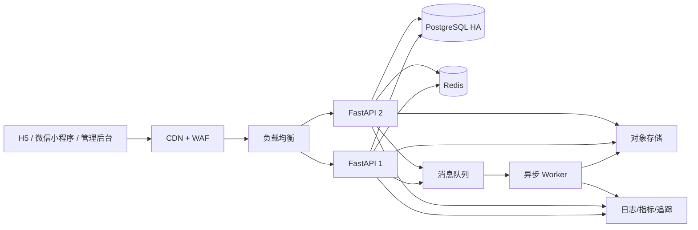

# 规模化路线图

目标愿景是让大量居民、志愿者和救助组织共同改善流浪猫处境。但用户规模必须建立在数据安全、审核治理和可恢复性上，不能只通过增加服务器配置来宣称“支持几十万人”。

## 当前基线

```text
单台云服务器
Nginx
单个 Uvicorn/FastAPI 服务
SQLite
本地图片目录
浏览器/小程序 Bearer Session
人工管理后台审核
```

该架构适合业务验证和受控试运行。它的主要风险是单点故障、SQLite 写竞争、本地文件绑定、无分页、无集中限流、无异步处理和缺少监控。

## 阶段 0：正式小程序上线基础

目标：让真实用户可以在合规、安全、可回滚的环境中使用。

交付：

- 域名、HTTPS 和微信合法域名。
- 真实微信登录。
- 隐私政策、用户协议、注销和数据删除。
- 图片 EXIF 与内容安全策略。
- 自动备份、恢复演练和基本监控。
- H5/小程序统一错误码和版本管理。

验收门槛：

- 核心流程真机通过。
- 关键接口有成功率、延迟和错误率指标。
- 数据库与图片备份可恢复。
- 严重故障有明确回滚步骤。

## 阶段 1：消除单机数据瓶颈

目标：服务可以扩容，图片和数据库不再绑定一台机器。

交付：

- SQLite 迁移到 PostgreSQL。
- 图片迁移到对象存储，使用 CDN 分发。
- API 列表增加分页、游标和上限。
- 数据库索引按真实查询和慢查询调整。
- 数据迁移校验、灰度切换和回滚工具。

验收门槛：

- 迁移前后用户、小区、猫咪、任务、媒体和审计数量一致。
- 抽样业务记录和图片关联一致。
- 失败可在明确时间内回到旧数据库。
- 不再依赖单机本地上传目录提供媒体。

## 阶段 2：无状态服务和流量保护

目标：FastAPI 可以水平扩容，并在突发传播时保护核心数据。

交付：

- Redis 保存会话、限流计数、短期缓存和幂等键。
- 多个 API 实例放在负载均衡后。
- 登录、注册、上传、建档、领取任务分别设置限流策略。
- 所有写接口支持幂等或重复提交保护。
- 数据库连接池、超时、重试和熔断策略。
- WAF、机器人防护和异常 IP/设备策略。

验收门槛：

- 任一 API 实例退出时用户请求仍可继续。
- 压测达到目标峰值并保留安全余量。
- 限流不会误伤管理员紧急操作。
- 重复点击不会生成重复档案或重复任务领取。

## 阶段 3：异步任务与内容治理

目标：把耗时或高风险工作从同步请求中移出，建立社区治理闭环。

交付：

- 消息队列处理图片压缩、EXIF 清理、内容安全和通知。
- 审核工作台支持驳回理由、批量操作、优先级和积压指标。
- 举报、申诉、封禁和审计日志查询。
- 猫咪重复档案候选检测，但保留人工确认。
- 救助任务完成、取消、转派、证据和通知。

验收门槛：

- 队列任务可重试、有死信队列且幂等。
- 敏感内容不会在审核前公开。
- 所有治理操作有操作者、原因和前后状态。
- 审核积压超过阈值时自动告警。

## 阶段 4：可靠性与数据平台

目标：形成可量化的服务可靠性和公益效果评估。

交付：

- 指标、日志、链路追踪和统一告警。
- 明确 SLO：可用性、延迟、错误率、登录成功率、上传成功率。
- PostgreSQL 高可用、PITR 和跨区域备份。
- 容量预测、故障演练和应急手册。
- 隐私友好的产品分析，不收集不必要的精确位置。
- 猫咪档案、绝育、医疗、领养和救助任务的效果指标。

## 推荐的目标架构



## 数据与隐私治理

规模越大，精确位置泄漏和内容滥用风险越高。必须坚持：

- 精确坐标与公开模糊位置分开存储和授权。
- 管理员查看敏感位置需要明确用途和审计。
- 图片默认清理 EXIF。
- 数据按用途和保存期限分类。
- 提供注销、删除、导出和申诉渠道。
- 不通过公开 API 暴露手机号、微信号或猫窝精确坐标。

## 不建议过早做的事

- 业务量没有证据时拆成大量微服务。
- 为了“AI”标签自动决定救助或医疗结论。
- 未经人工复核自动合并猫咪档案。
- 在没有治理能力前开放精确地图或公开联系方式。
- 用压测结果替代真实监控和故障恢复能力。

架构升级由真实瓶颈、安全要求和上线门禁触发，而不是由宣传数字触发。

